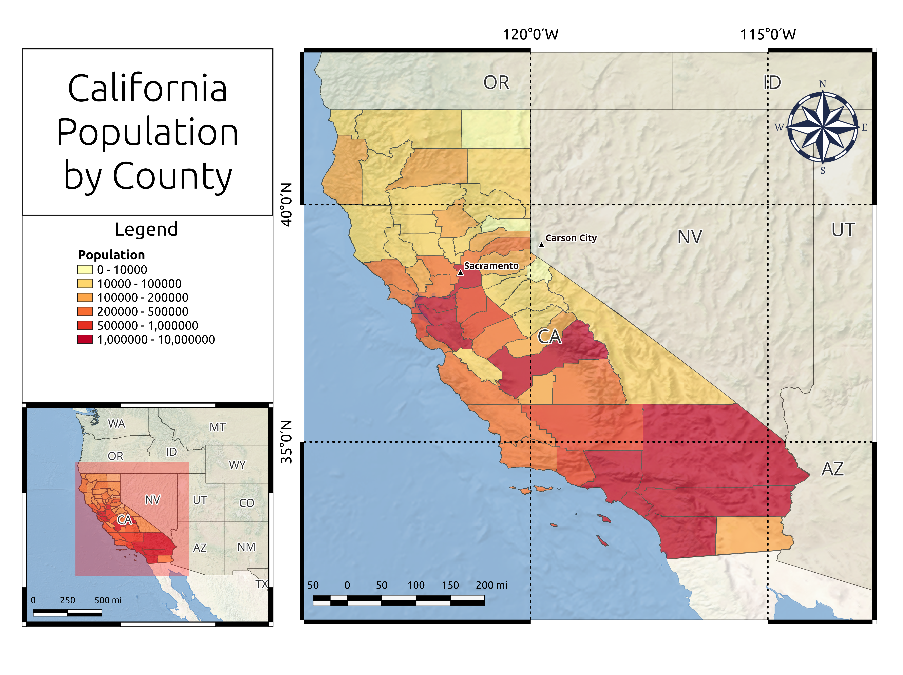

# California Population Map

A population map of California created to get familiar with QGIS

## Tools used
- [QGIS](https://www.qgis.org/en/site/)

## Data Sources
 - [Natural Earth](https://www.naturalearthdata.com)
 - note: shapefiles/terrain/NE2_LR_LC_SR_W.tif was removed for file size limitations, download from [here](https://github.com/nvkelso/natural-earth-raster/tree/master/10m_rasters/NE2_LR_LC_SR_W)

